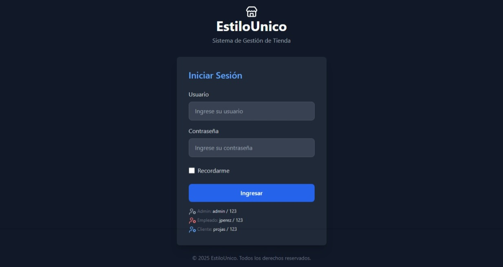
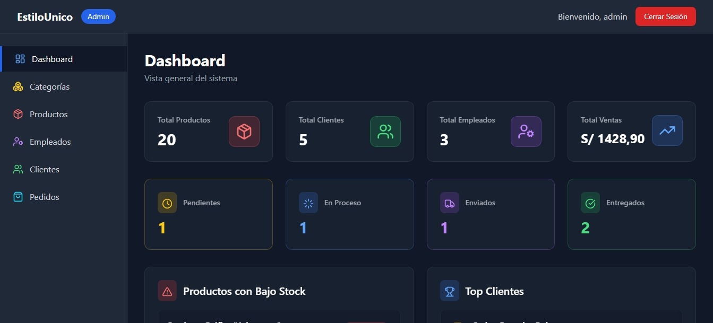
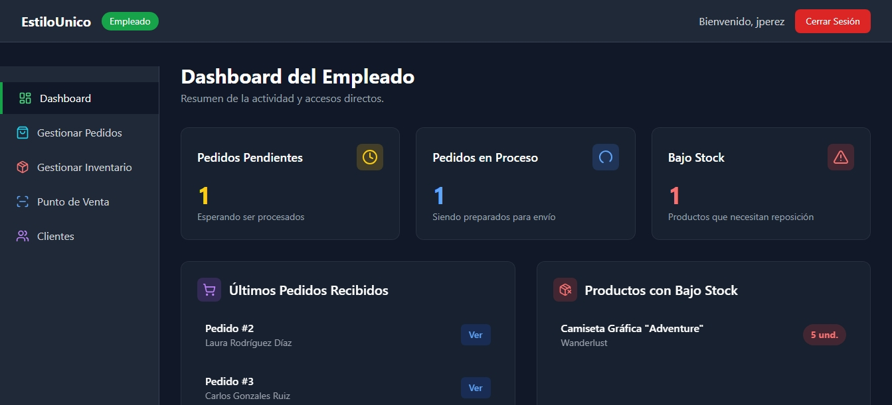
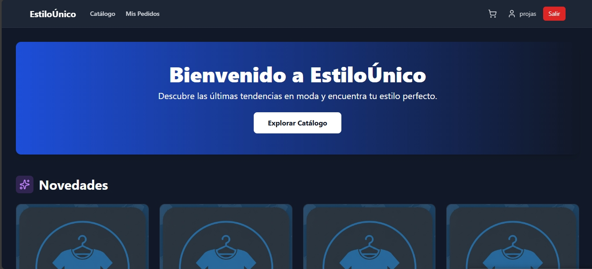

# Estilo Unico

Aplicación web de e-commerce para venta de ropa, calzado y accesorios. Desarrollada en Spring Boot con Thymeleaf, Spring Data JPA, MySQL y diseño responsivo con Tailwind CSS.
Es posible ver el proyecto desplegado aqui: **[Ver el proyecto](https://spring-web-production-ad79.up.railway.app/)**

---
### LOG IN


### DASHBOARD ADMIN


### DASHBOARD EMPLEADO


### DASHBOARD CLIENTE


Capturas completas: [screenshots](screenshots).

---
## Descripción

Estilo Unico es una plataforma tipo tienda online que permite gestionar productos, pedidos y usuarios con tres roles principales: administrador, empleado y cliente. Cada rol dispone de un dashboard propio con funcionalidades específicas.

---

## Tecnologías usadas

- Spring Boot
- Spring Data JPA
- Thymeleaf para vistas HTML
- MySQL
- Tailwind CSS

---

## Estructura del proyecto

- `com.estilounico` - clase principal: ProyectoEstilounico2Application
- `com.estilounico.controller` - controladores públicos y login
- `com.estilounico.controller.admin` - CRUD admin (productos, categorías, clientes, empleados, pedidos, dashboard)
- `com.estilounico.controller.cliente` - vistas y acciones cliente (productos, carrito, checkout, perfil, pedidos)
- `com.estilounico.controller.empleado` - interfaz empleado (POS, inventario, pedidos, clientes)
- `com.estilounico.service.impl` - implementación servicios
- `com.estilounico.repository` - repositorios JPA
- `com.estilounico.model` - entidades (Usuario, Cliente, Empleado, Producto, Categoria, Pedido, DetallePedido, CarritoItem)
- `com.estilounico.config` - interceptores para control de acceso según rol

---

## Entidades principales

| Entidad       | Campos clave                                                                               |
|---------------|--------------------------------------------------------------------------------------------|
| Usuario       | id, username, password , email, rol, fechaRegistro, activo,...                             |
| Cliente       | id, usuario, nombreCompleto, direccion, telefono,...                                       |
| Empleado      | id, usuario, nombre, telefono, direccion,...                                               |
| Producto      | id, nombre, precio, categoría, stock, activo, fechaCreacion,...                            |
| Categoria     | id, nombre, descripcion, activo,...                                                        |
| Pedido        | id, fechaPedido, estado, total, direccionEnvio,...                                         |
| DetallePedido | id, pedido, producto, cantidad, precioUnitario,...                                         |
| CarritoItem   | id, cliente, producto, cantidad,...                                                        |

---

## Configuración del proyecto
### 1. Importar el proyecto en tu IDE, para STS:

1. Clonar el repositorio en una carpeta
2. Abre **Spring Tool Suite (STS)**.  
3. Ve al menú **File → Import...**  
4. Selecciona **Existing Maven Projects** y haz clic en **Next**.  
5. En el campo **Root Directory**, busca la carpeta del proyecto descargado.  
6. Verifica que el archivo `pom.xml` esté seleccionado y haz clic en **Finish**.  
7. Espera que STS descargue las dependencias de Maven y compile el proyecto.

---

### 2. Configuración de la base de datos y conexion
1. Crear la base de datos MySQL con el script proporcionado.
   [bd-scripts/BD-estilo-unico.sql](bd-scripts/bd-estilo-unico.sql).
3. Configurar src/main/resources/application.properties con tus credenciales MySQL:
   
```
spring.datasource.url=${JDBC_DATABASE_URL:jdbc:mysql://localhost:3306/estilounico_db?allowPublicKeyRetrieval=true&useSSL=false&serverTimezone=UTC}
spring.datasource.username=${MYSQLUSER:USUARIO}
spring.datasource.password=${MYSQLPASSWORD:CONTRASEÑA}
```
---

### 3. Ejecución del proyecto

1. En STS, haz clic derecho sobre el proyecto → Run As → Spring Boot App
2. Espera a que la consola indique que el servidor Tomcat se ha iniciado correctamente.
3. Abre el navegador y accede a la URL:
   
```
http://localhost:8080
```
---

## Licencia

Este proyecto está bajo la Licencia MIT. Consulta el archivo `LICENSE` para más detalles.

---
